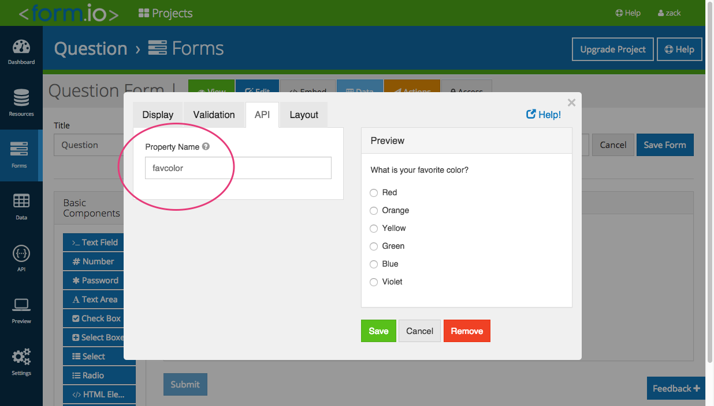

Form.io Question
---------------------
An Angular.js directive that provides quiz capabilities to a [Form.io](https://form.io) form using the following simple directive.

```
<formio-question src="'https://project.form.io/form'" question="componentKey"></formio-question>
```

This directive uses the Component Key for rendering a specific portion of a Form as a single aggregate submission.

Options
==================

The following options are available for the directive, to further customize the output:

`submission` {Object} If provided, the question will use the provided submission object

`preview-results` {Boolean, default: false} If provided, the results button will be available before a submission has been made.

`update-answer` {Boolean, default: false} If provided, the results page will contain a question button to allow the submission to be changed.

`chart` {String: default: table} If provided, the results will be displayed using the given type.
  - Available: table, pie

`chartAdvanced` {Object} If provided, nvd3 will use these options for a chart rather than an internal type. Requires `chartDataCustomizer` if provided. See [NVD3 Documentation](http://krispo.github.io/angular-nvd3/#/) for more information.

`chartDataCustomizer` {Function} If provided, the results of all submissions will be run through this function before given to the chart defined in `chartAdvanced`. A single parameter data will need to be modified to fix the key:value pairs for the provided chart.

Getting Started
===================
You will first need to create an account at https://form.io. Go there now and sign up for a free account.

Installation
====================
To install this within your application, you will need to use bower.

```
bower install formio-question --save
```

Then, you will need to add the wizard and its dependencies to your HTML page.

```
<script src="bower_components/lodash/dist/lodash.min.js"></script>
<script src="bower_components/jquery/dist/jquery.js"></script>
<script src="bower_components/angular/angular.js"></script>
<script src="bower_components/ng-file-upload/ng-file-upload.js"></script>
<script src="bower_components/angular-sanitize/angular-sanitize.js"></script>
<script src="bower_components/angular-bootstrap/ui-bootstrap-tpls.js"></script>
<script src="bower_components/moment/moment.js"></script>
<script src="bower_components/angular-moment/angular-moment.js"></script>
<script src="bower_components/ui-select/dist/select.js"></script>
<script src="bower_components/bootstrap/dist/js/bootstrap.js"></script>
<script src="bower_components/bootstrap-ui-datetime-picker/dist/datetime-picker.min.js"></script>
<script src="bower_components/signature_pad/signature_pad.js"></script>
<script src="bower_components/angular-ui-mask/dist/mask.js"></script>
<script src="bower_components/formio/dist/formio.js"></script>
<script src="bower_components/d3/d3.js"></script>
<script src="bower_components/nvd3/build/nv.d3.js"></script>
<script src="bower_components/angular-nvd3/dist/angular-nvd3.js"></script>
<script src="bower_components/formio-question/dist/question.js"></script>
```

Now, you will need to add this to your Angular.js module as a dependency like the following.

```
angular.module('myApp', ['formio.question']);
```

Example
================
Take a look at **index.html** for an example implementation of this quiz capability.

How it works
================
This directive uses form components to render specific questions. Because of this, you will need to create your form
and supply a component API key to the directive for rendering.



License
================
[MIT](./LICENSE.md)
